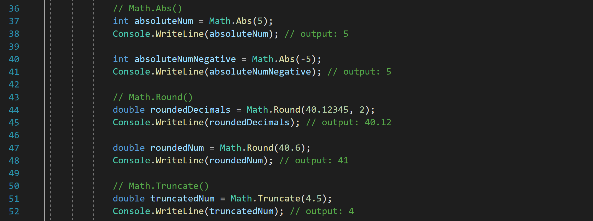

# Csharp-maths-functions
This is a console app with a list of a few Maths functions.

These functions include:
* Math.Max()
* Math.Min()
* Math.Abs()
* Math.Round()
* Math.Truncate()
* Math.Sin()
* Math.Cos()
* Math.Tan()
* Math.Pow()
* Math.Sqrt()

## Prerequisites 

* Make sure you have Visual Studio installed. 

## To Run

* Navigate to the **MathsFunctionsCSharp** folder.
* Click on MathsFunctionsCSharp.sln to open the solution.

## Example

